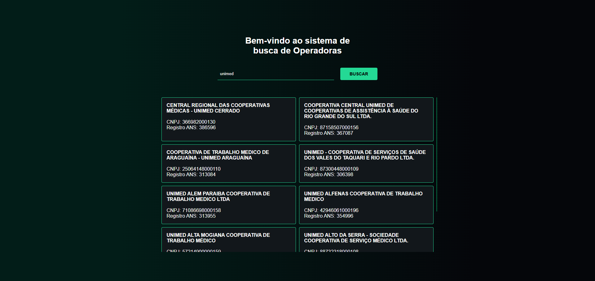
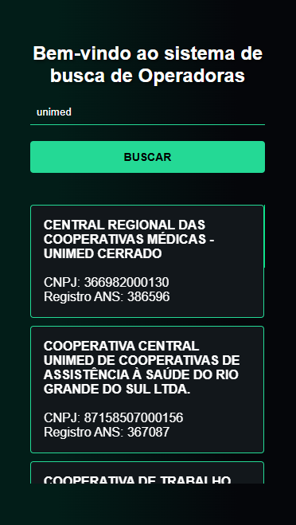

# Documentação do Teste - IntuitiveCare

## Objetivo

Este documento detalha a implementação do teste técnico, desde o Web Scraping até o envio da coleção do Postman para teste de API.

## 1. Web Scraping

**Objetivo:** Acessar o site da ANS, baixar os PDFs e compactá-los.

### Tecnologias Utilizadas:

-   Python
    
-   Requests
    
-   BeautifulSoup
    
-   PyPDF2
    
-   Tabula-py
    
-   Pandas
    

### Execução:

1.  Acesse o site: https://www.gov.br/ans/pt-br/acesso-a-informacao/participacao-dasociedade/atualizacao-do-rol-de-procedimentos
    
2.  Baixe os PDFs dos Anexos I e II.
    
3.  Salve e compacte em um arquivo ZIP.
## 1. Web Scraping

**Objetivo:** Acessar o site da ANS, baixar os PDFs e compactá-los.

### Tecnologias Utilizadas:

-   Python
    
-   Requests
    
-   BeautifulSoup
    
-   PyPDF2
    
-   Tabula-py
    
-   Pandas
    

### Execução:

1.  Acesse o site: https://www.gov.br/ans/pt-br/acesso-a-informacao/participacao-dasociedade/atualizacao-do-rol-de-procedimentos
    
2.  Baixe os PDFs dos Anexos I e II.
    
3.  Salve e compacte em um arquivo ZIP.

**Comando para execução:**

    python web_scraping.py
    
## 2. Transformação de Dados

**Objetivo:** Extrair os dados da tabela "Rol de Procedimentos e Eventos em Saúde" e salvar em CSV.

### Execução:

1.  Extração dos dados do PDF do Anexo I.
    
2.  Salvamento dos dados estruturados em CSV.
    
3.  Substituição das abreviações OD e AMB por suas descrições completas.
    
4.  Compactação do CSV.
    

**Comando para execução:**

    python data_processing.py

## 3. Banco de Dados

**Objetivo:** Criar um banco PostgreSQL no Docker, estruturar tabelas e importar os dados.

### Tecnologias Utilizadas:

-   PostgreSQL (via Docker)
    
-   SQL
    

### Configuração do Docker:

    docker run --name postgres-intuitivecare -e POSTGRES_PASSWORD=senha123 -p 5433:5432 -d postgres:latest

### Execução:

1.  Baixar os arquivos financeiros e cadastrais.

     python database/scripts/baixar_arquivos.py
     python database/scripts/baixar_dados_cadastrais.py
    
2.  Criar tabelas no banco.

     python database/scripts/criar_tabelas.py
    
3.  Importar os dados.

    python database/scripts/importar_dados_cadastrais.py
    python database/scripts/importar_dados_trimestrais.py
    
4.  Executar queries analíticas.

**Acessar o banco de dados via terminal com psql:**

       psql -h localhost -U postgres -p 5433 -d postgres

**Execução das queries:**

      python database/scripts/query_analitica.py

## 4. API

**Objetivo:** Desenvolver uma interface web com vue.js que interaja com um servidor em Python

### Tecnologias Utilizadas:

-   Flask
    
-   Flask-CORS
    
-   PostgreSQL
    
-   Pandas
    

### Estrutura do Projeto:

-   `app.py` (código principal da API)
    
-   `database.py` (conexão com o banco de dados)
    
-   `requirements.txt` (dependências do projeto)

### Execução:

    python app.py

A API roda localmente em:

    http://localhost:5000
  
  **Exemplo de Requisição:**

    GET http://localhost:5000/buscar_operadoras?termo=amil
## 5. Frontend

**Objetivo:** Criar uma interface Vue.js para interagir com a API.

### Tecnologias Utilizadas:

-   Vue.js
    
-   Vue Router
    
-   Vuex
    
-   Axios
    

### Instalação e Execução:

    yarn install
    vue serve
    
O frontend roda localmente em:

    http://localhost:8080

### Imagens da Interface:

    
## Conclusão

O teste foi implementado com sucesso, abrangendo todas as etapas solicitadas. A API e o frontend funcionam localmente e são validados através do Postman.